# 神经网络

## 图象分类问题

### 挑战：

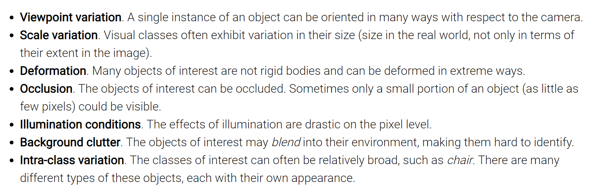

### 数据驱动方式（data-driven approach）：

提供多种多样的数据集类型

### 最近邻分类器（Nearest Neighbor Classifier）：

L1距离：
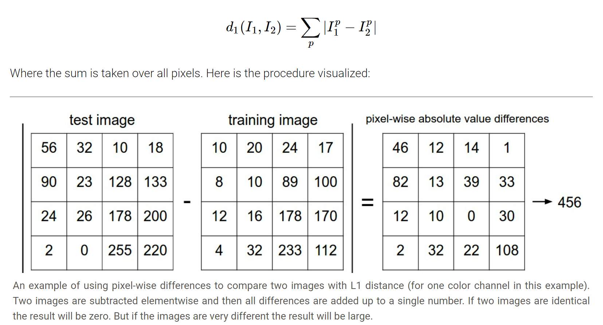
L2距离：
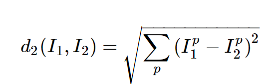

### K-近邻分类器：
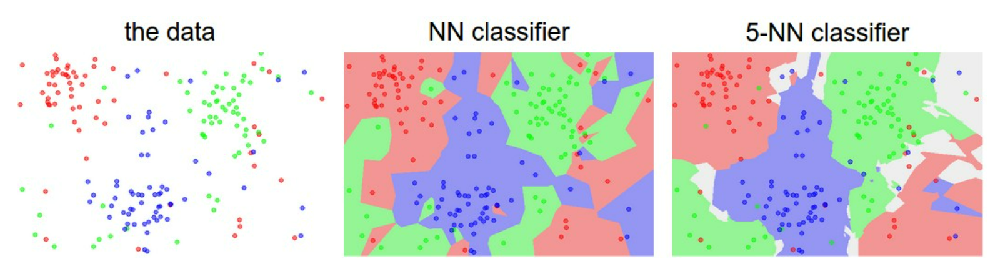
k越大，对异常点的鲁棒性越强。

---

而如何选择k、距离计算方式....等超参数？
切记Evaluate on the test set only a single time, at the very end。因此可以将训练集划分为训练集和验证集；用验证集调整超参数。
同时针对训练集数量较小的情况，还可以利用交叉验证（Cross-validation）：
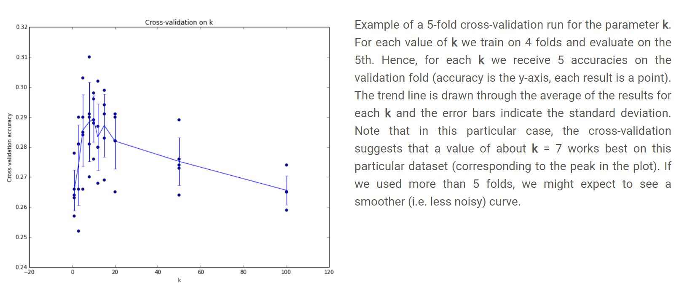
**近邻分类器在训练时只用储存像素值（消耗空间），而在验证时需要与每个图像比较（消耗时间），即与神经网络相反。但是也可以被用在数据预处理、检索阶段（构造kdtree或者是跑K-means聚类算法）；而不适合图像分类问题，因为它只是简单的把相似颜色背景的图片聚在一起而忽略的图片的实际语义**

## 线性分类器
### 本质：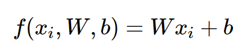
$x_i$：第i张图片flatten后的高维向量（D$\times$1）
$W$：权值矩阵（K$\times$D）
$b$：偏置向量（K$\times$1）
**结果是图片属于每个类的score**
**Bias trick：**
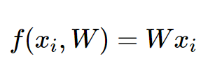
即将$W和x_i$多增加一个维度：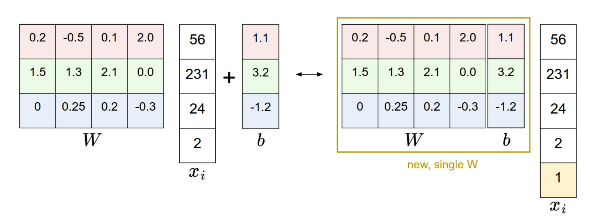
### 解释性
* 高维点被高维平面分割，$W$中的每一行都作为各个类的分类器
* 类比模板匹配问题，$W$中的每一行对应每个类别的模板，模板包含了每个类的特征，类似于近邻比较用图片与这个模板比较得到其得分

### Multiclass Support Vector Machine Classifier
* SVM loss/Hinge loss/Max-margin loss：目的是通过固定Δ来使得正确类别的得分比不正确类更高。
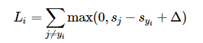
对于第i张图片而言，假设其正确分类为yi类：$s_j$代表预测第j类的得分；$s_{yi}$代表预测正确类别的得分；Δ是固定的阈值（也是一个超参数，但是可以直接设为1，然后只调整之后的λ即可）
代入W矩阵即为：
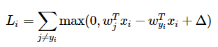
*且还有平方形式，具体效果可以通过交叉验证对比*
* Regularization loss：
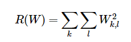
正则化loss可以较好的提升模型的泛化性能避免过拟合。

综上，总的loss可以表示为:
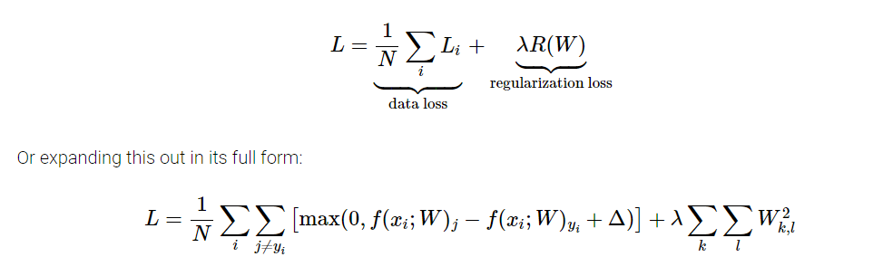
其中通过交叉验证设置超参数λ可以平衡正则化loss与data loss；
### Softmax Classifier
Softmax function：$f_j(z)=\frac{e^{z_j}}{\sum_ke^{z_k}}$：可以将一个向量各元素归一化，实际中为了保证计算可行性，取为：
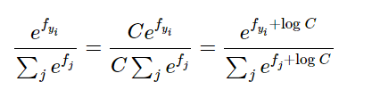
其中$logC=-maxf_j$

Cross-entropy loss：
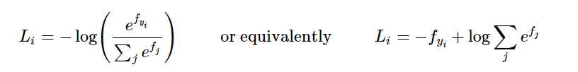
信息论解释：对于用q估计真实分布p的交叉熵定义为

q即为计算得到的归一化后的各类概率，而p只在正确类处取1。对应于上述交叉熵损失公式。

**综上**
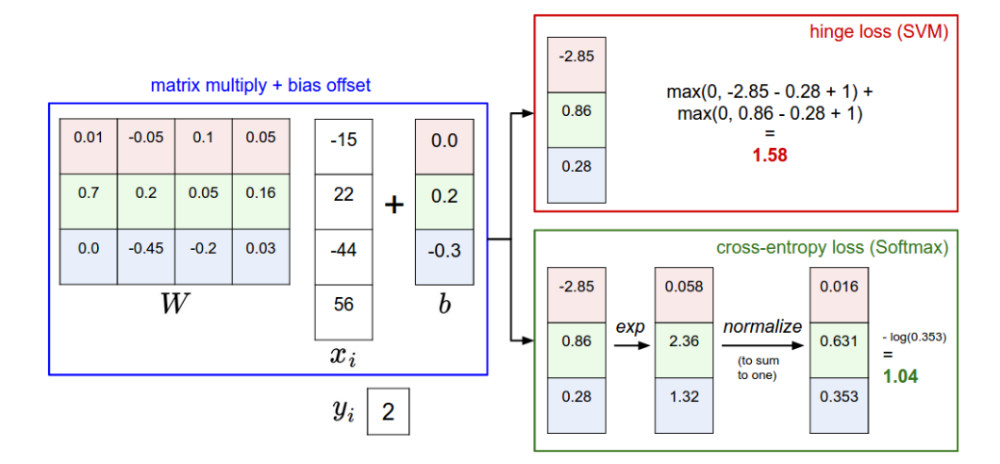
* SVM分类做出的可以视为分类器给出的属于各类的分数；而Softmax给出的是属于各类的置信度，但是置信度横向上可能由于λ的设置而更扁平（λ越大，W越小，算出的结果也就越小、越均匀），但是排序上仍然可解释。
* SVM分类器的局部目标性更强，也就是说对于已经达到Δ的样本不会再关心分数的细节，即其不能察觉到[10, -100, -100] 或 [10, 9, 9]的差别；而Softmax会永远不满足于结果而是会让正确类别有更高的置信度并且不断优化loss。比如对于一个汽车分类器，SVM会花精力在区分轿车与卡车而不受一张青蛙照片的影响。